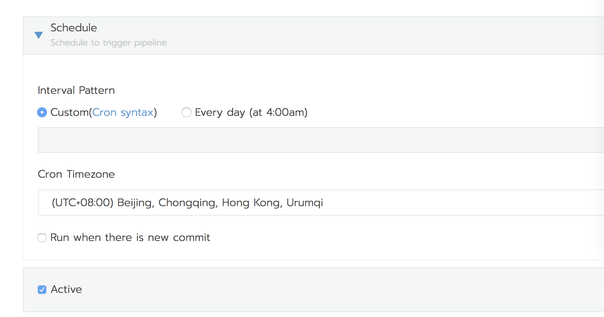
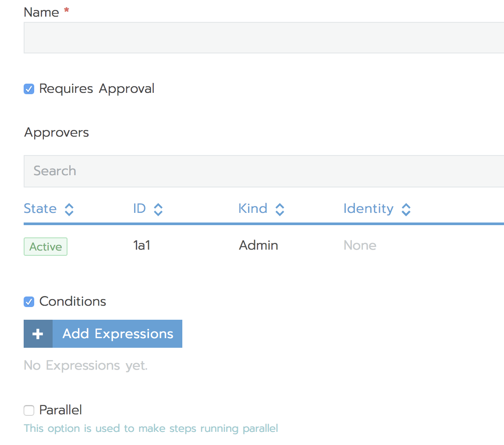
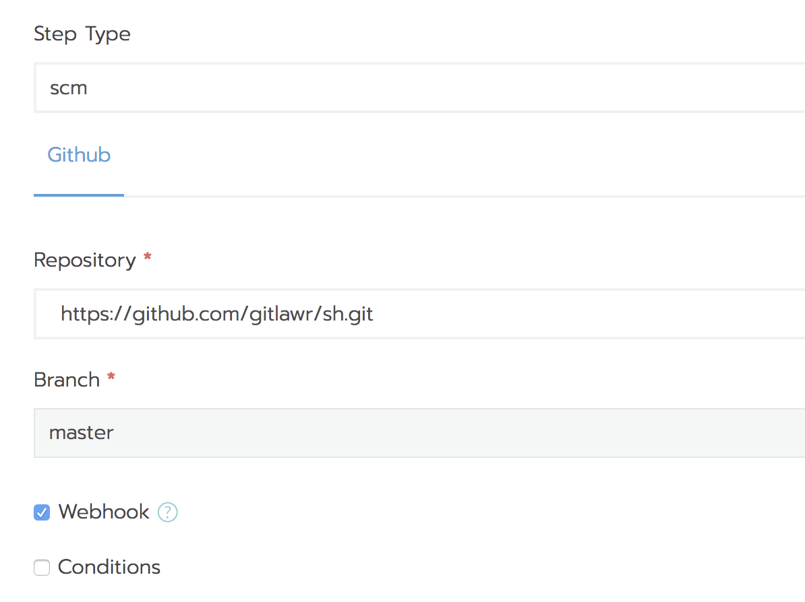
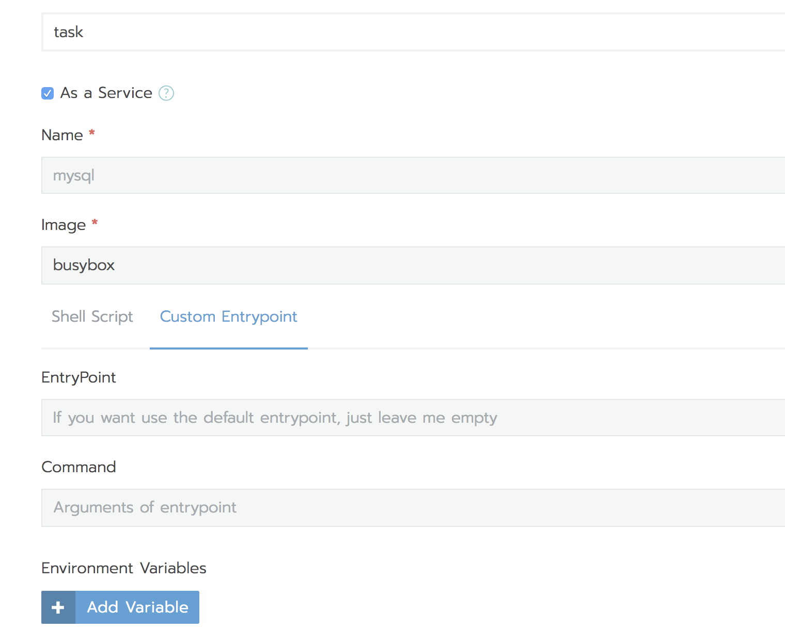
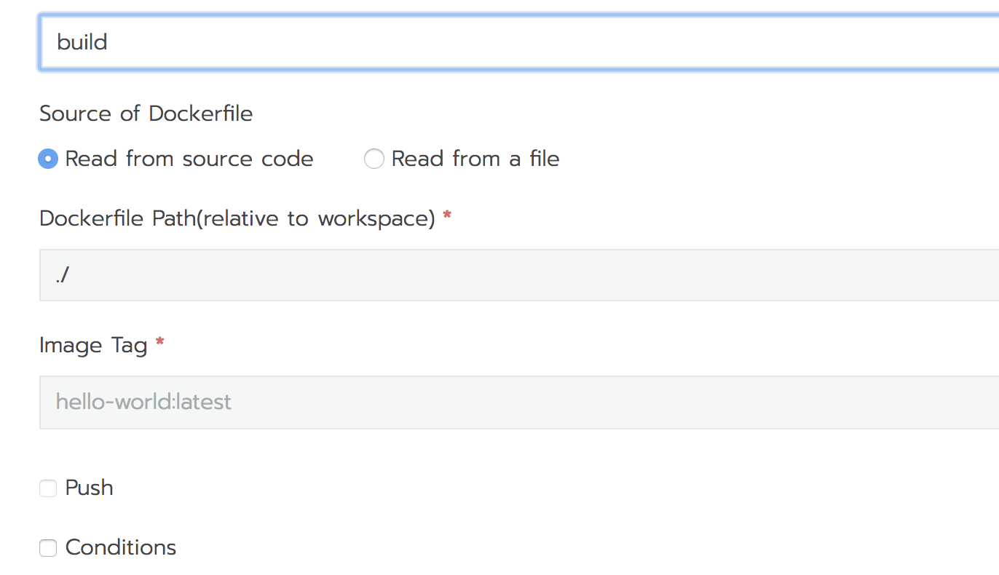
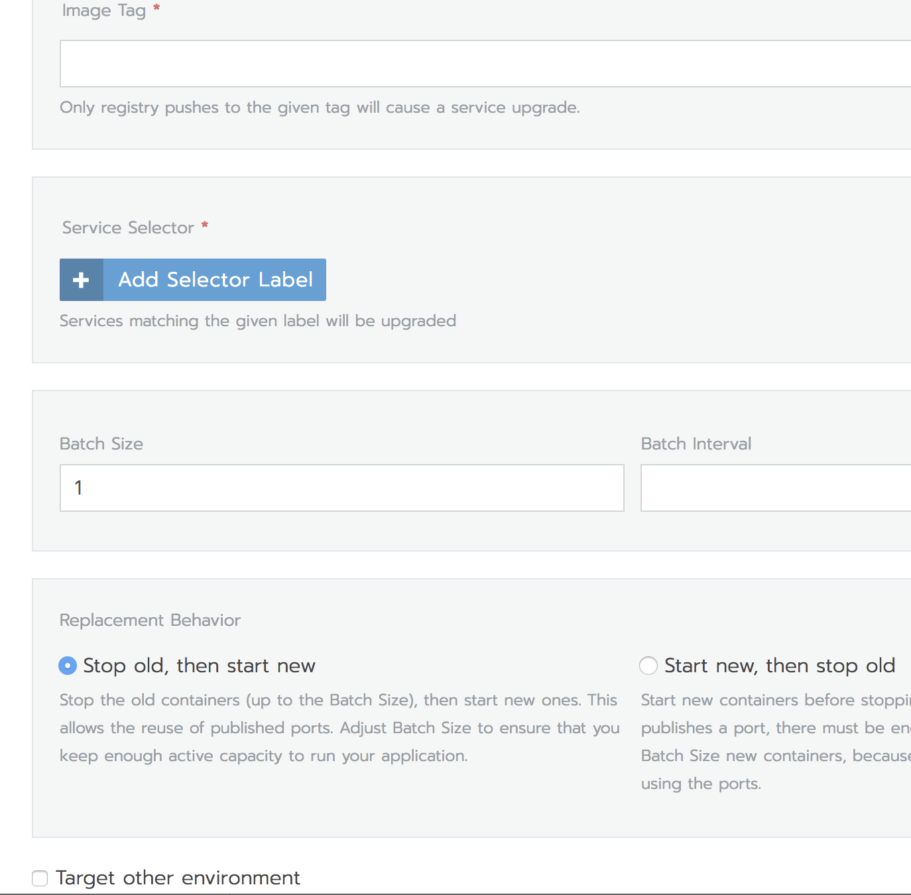
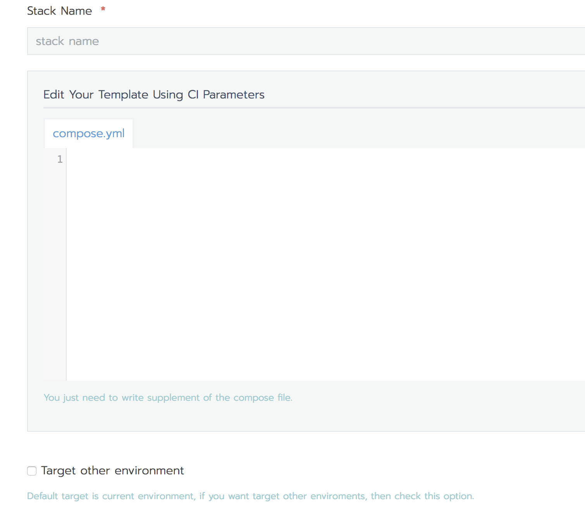

# Rancher CI/CD

Easier to use, Easier to integrate CI/CD with Rancher.

## Dependencies

- Jenkins-master: Based on jenkins:2.60.2.
- Jenkins-boot: Store the setup information including initial admin user and plugins 
  - Plugins list (see `/pluginManager/installed` after deploy jenkins-master)
  - Default user (User: admin, Password: admin)
- Jenkins-slaves: workers to do CI jobs.
- pipeline-server: The main service for connecting rancher and jenkins-master, and maintaining the major logic of CI/CD.

## Concept

Basic Concept of Rancher Pipeline

### Pipeline

Pipelines are the construct defining a CI flow. Pipelines consist of stages and stages run sequentially. Pipelines must start with SCM.
There two Critical concepts here -- `Stage` and `Step`

#### Stage

A `Stage` consists of a group of actions, known as `Steps`. You can name a stage using `Test`, `Build`, etc. Steps in a stage can run in sequence or parallel. Further more, you can configure `approvers` on a `Stage` so that `Activity` will be pending when it reaches this stage, after `approver` approve this `Stage`, `Activity` will continue to run. 

>**Note:** you can't configure name or approvers on the first stage, because we design it as an initial step to checkout source code.

#### Step

A `Step` is a minimum execution unit. There are different types of `Step` dedicated for different jobs. For more details, see [Steps](#step-types)

#### Status
- ##### Active
  An active `Pipeline` means automated triggers such as the cron task and webhook are enabled.

- ##### Inactive
  An inactive `Pipeline` means automated triggers are disabled. you can only run the pipeline manually. 

### Activity

An `Activity` is an execution of `Pipeline`. It contains the runtime status and result of the execution, including Start Time, End Time, Git commit, Logs, etc.

#### Status

- ##### Building
  Activity is running.

- ##### Pending
  Activity is waitting for approval.

- ##### Denied
  Activity has been denied.

- ##### Success
  Activity succeed.

- ##### Fail
  Activity failed.

- Abort

  Activity terminated by user.

## User Guide

Deploy `Rancher Pipeline` to your Rancher Environment, and add a pipeline to automatically build, test and deploy your code.

### Deploy

#### Prerequisites
- Rancher is set up and available hosts are added. 
- [Library catalog](http://rancher.com/docs/rancher/v1.6/en/catalog/)

Launch App called CICD from [Library catalog](http://rancher.com/docs/rancher/v1.6/en/catalog/).

When CICD is deployed, there will be a tab called Pipeline show in the top menu.

Click tab Pipeline to use our CICD.

### Source Code Manager(SCM) authorization

Before adding a pipeline you will need to add SCM authorization. You can go to setting page by clicking setting button on top right corner of CICD page. When you try to add a pipeline before setting auth, hint links will also guide you there. Currently Github Oauth is supported. You can do it by following the setting guide.

When a git account is authed, it is bound to the Rancher user. The git account and its relevant pipelines and activities are only accessible by the user. The owner user can share the git account, then the resources will be accessible in environment scope.

A Rancher User can add multiple git account using oauth.

### Create a Pipeline

After Navigate to Pipeline tab on top menu, there will be two tabs called `Activities` and `Pipelines`. Click `Pipelines`. Then Click `Add Pipeline` on the top-right corner of `Pipeline table`. You have to start with the SCM stage in which git account and git repository is required. After configure your git repository, you can start to configure your pipeline using different [Step types](#step-types).

#### Import/Export a Pipeline

A Pipeline can be defined as a yaml file. You can view a pipeline config by pipelines' `View config` action.

To import a pipeline, you can click `import pipeline.yml` button on the pipeline list page, then paste the pipeline file content or upload a file and click `Add`.

To export a pipeline, click `Export config` action of a pipeline. The pipeline file will be downloaded.

#### Set approvers

On every stage except the first one, you can authorize some users to approve it. When `Activity` produced by this Pipeline progress to the stage need to be approved, The `Activity` will be pending until someone approve/deny it.

#### Step types

- ##### SCM
  SCM(Source Code Management) will only available on the first stage. This step is used to checkout git repository.

- ##### Task
  Task is the most fundamental type, and yet is the most powerful type. you can use any image you want to excute the CI.
>**As a Service:** When you check `As a Service` checkbox, it means this container will keep running until the whole pipeline finish. This is very useful when you want to use a database as a test db. For more details see [Run a mysql server](#run-a-mysql-server)

- ##### Build
  Build is used to build a image from dockerfile which come from your source code or the file you upload. you can config it in the UI. Also you can use [Environment Variables](#environment-variables) to tag your image

- ##### Upgrade Service
  Upgrade Service is used to upgrade a service in any environment, the default target environment is the environment that CICD is deployed on, you can target other environments by providing `Environment API Key`. You can use [Environment Variables](#environment-variables) to access the image build from `Build` step.

- ##### Upgrade Stack
  Upgrade Stack is used to upgrade a stack in any environment, the default target environment is the environment that CICD is deployed on, you can target other environments by providing `Environment API Key`. You can use [Environment Variables](#environment-variables) to access the image build from `Build` step. 

- ##### Upgrade Catalog 


  Upgrade Catalog is used to upgrade a catalog. By selecting a catalog item and providing docker-compose and rancher-compose file templates, you can add a new version of the catalog item in related git repository. You can choose to upgrade a stack to the newly updated version.

#### Set Cron Task

you can set cron task to run pipeline at intervals. Also, you can configure the cron TimeZone to your local timezone or others.

### Run Pipelines

After create a Pipeline, you can run it in the Pipelines table by clicking the action menu, finding the `Run` button. Also, you can run multiple Pipeline in the Activities tab, by clicking `Run pipeline` button, and choosing the pipeline you want to run.

#### Activity Logs

After run a pipeline, there will be an acitivity produced. you can access the logs in the detail page. And, you can access the console log of every step by clicking the step name under the Record.

### Environment Variables

The following variables are available in most inputs, including shell scripts, image tag, compose file template, etc. (except `git branch` and `timeout` config currently). Users can add user-define parameters in pipeline configuration. They act as the same role except that they are defined by users. When you input '$' in pipeline configuration inputs, we will pop up available variables for you to choose.

| NAME                   | DESC                   |
| ---------------------- | ---------------------- |
| CICD_GIT_COMMIT        | git commit sha         |
| CICD_GIT_BRANCH        | git branch             |
| CICD_GIT_URL           | git repository url     |
| CICD_PIPELINE_ID       | pipeline id            |
| CICD_PIPELINE_NAME     | pipeline name          |
| CICD_TRIGGER_TYPE      | trigger type           |
| CICD_NODE_NAME         | jenkins node name      |
| CICD_ACTIVITY_ID       | activity id            |
| CICD_ACTIVITY_SEQUENCE | run number of activity |

### Backup/Restore

The CICD data are stored in two separate place, the whole pipeline and basic activity status informations are stored in the `generic object` of rancher/server's database, the detailed console log of activity and workspace data is stored on hosts running jenkins master/slave. So, if you want to backup the whole app data, you have to back up these two data.

#### Backup/Restore Pipeline data

Pipeline data is stored in Rancher server. Please refer to Rancher documentation for data backup/restore.

#### Backup/Restore Jenkins data

If you want to backup the Jenkins data, just copy the Volume of jenkins home directory into your backup directory. When you want to restore these data, use your backup directory for recovery.

## Configuration Reference

### Pipeline configurations



Interval Pattern: cron expression for running the pipeline, expected five fields separated by white space.

Cron Timezone: timezone for the cron scheduler.

Run when there is new commit: run only when there are new commits since last run of the pipeline.

Active: enable/disable automated triggers.

### Stage configurations



Name: stage name

Requires Approval: If enabled, the activity will pend before this stage until an approver approve/deny it.

Approvers: A list of users who can approve the pending stage. If it is left empty, everyone can approve it.

Conditions: If conditions are set, the stage will run only when conditions are satisfied. Otherwise it will be skipped and following stages continue.

Parallel: If enabled, all steps in this stage can run in concurrently. There's no guarantee of the steps' running order. And concurrent number depends on executor size of the jenkins master/slave, which can be set when deploying CICD catalog.

### Step Configurations

#### SCM



Repository: repository of the source code

Branch: git branch to use.

Webhook: If enabled, CICD will automatically create github webhook when pipeline is created, and pipeline will be triggered if there is new push event. This requires that Rancher server is able to receive github webhooks.

#### Task



As a service: If enabled, The task is expected to run a service during the rest of the activity lifetime. The service can be referenced by following steps using `Name`. It will be cleanup when the activity finish.

Name: An alias that following steps use to reference the service. Required when `As a service` is enabled.

Image: context image to run the task.

ShellScript: shell script to run. If it is set, the script will be wrapped in a file and run by `/bin/sh` as the entrypoint.

Custom Entrypoint: entrypoint for a `docker run` using `Image`

Command: command for a `docker run` using `Image`

Environment Variables: environment variables passing to docker run command. These environment variables are available in the container context so you can use them in shell scripts, but you cannot use them in custom entrypoint, image, etc. where pre-define or user-define parameters work.

Conditions: If conditions are set, the step will run only when conditions are satisfied. Otherwise it will be skipped and following steps/stages continue.

#### Build



Source of Dockerfile: source of Dockerfile used for `docker build`

Dockerfile Path: relative path of dockerfile path(docker build path is expected to be the same as Dockerfile path)

Image Tag: Image tag for the built image

Push: If enabled, will push the image to the registry. Credential is required to set in Rancher registries pages.

Conditions: If conditions are set, the step will run only when conditions are satisfied. Otherwise it will be skipped and following steps/stages continue.

#### Upgrade Service



Image Tag: upgrade chosen services to this image tag.

Service Selector: selector to filter services

Batch Size: upgrade batch size

Batch Interval: upgrade batch interval

Replacement Behavior: Container replacement behavior

Target Other environment: deploy to current environment by default. If deploy to other environment, API key is needed.

Conditions: If conditions are set, the step will run only when conditions are satisfied. Otherwise it will be skipped and following steps/stages continue.

#### Upgrade Stack



Stack Name: stack name to upgrade

Compose: compose file to upgrade. It can be incremental part, CICD will combine it with origin stack configs.

Target Other environment: deploy to current environment by default. If deploy to other environment, API key is needed.

Conditions: If conditions are set, the step will run only when conditions are satisfied. Otherwise it will be skipped and following steps/stages continue.

#### Upgrade Catalog

Catalog Item: select catalog and App

README,docker-compose,rancher-compose: template file to generate a new catalog item version.

Upgrade to the latest version: If enabled, upgrade a stack to the newly update catalog version.

## Pipeline File Definition

```
# pipelinefile.yaml
version: v1
# pipeline name
name: <string>
# enable/disable automated triggers
isActive: <bool> 
#cron trigger keys
cronTrigger:
  triggerOnUpdate: <bool> # trigger when there's new commit
  spec: <string> # cron expression
  timezone: <string> # cron trigger timezone

stages: #array
  - Name: <string>
    needApprove: <bool>
    parallel: <bool>
    approvers: ["id1","id2"] #<sting[]> for user ids
    # either all or any is used, each condition should be in `ENVVAR=VAL` or `ENVVAR!=VAL` format.
    conditions:
      all: <[]string>
        - "CICD_GIT_BRANCH=master"
        - "CICD_GIT_BRANCH!=master"
      any: <[]string>
        steps: [<step_spec>]


# <step_spec>:
# generic keys
#enum{"scm","task","build","upgradeService","upgradeStack","upgradeCatalog"}
type: <string>
conditions:
  # either all or any is used, each condition should be in `ENVVAR=VAL` or `ENVVAR!=VAL` format.
  all: <[]string>
    - "CICD_GIT_BRANCH=master"
    - "CICD_GIT_BRANCH!=master"
  any: <[]string>


#--- for `scm` type
scmType: <string> #enum{"github"},takes no effect currently
repository: <string>
branch: <string>
gitUser: <string>
webhook: <bool> #whether or not generates webhook automatically


#--- for `build` type
dockerFileContent: <string> # dockerfile content, if not set, use default for docker build.
dockerFilePath: <string> # dockerfile path, ignore if `dockerFileContent` is set.
targetImage: <string> # image name to build
push: <bool> # whether push the built image or not


#--- for `task` type
image: <string> # context image to run the task
isService: <bool> # whether run "as a service" or not
alias: <string> # alias to be referenced by other steps. ignore when `isService==false`


shellScript: <string> # shell script to run, will wrap it in a shell script file and run /bin/sh as the entrypoint.
entrypoint: <string> # entrypoint to run, will ignore if `shellScript` is not empty
args: <string> # the command for docker run, will ignore if `shellScript` is not empty


#--- for `upgradeService` type
imageTag: <string> # image for the services to upgrade (maybe change to "image"?)
serviceSelector: <map> # service selector
batchSize: <int>
interval: <int>
startFirst: <bool>
#deployEnv: <string> # upgrade services in current environment or not. enum{"local","others"} (change to bool maybe?)
endpoint: <string> # rancher server api endpoint when deploy to other env. If endpoint&api keys is not set, will deploy to current environment by default.
accesskey: <string> # rancher server api key to use when deploy to other env.
secretkey: <string> # rancher server api key to use when deploy to other env.


#--- for `upgradeStack` type
stackName: <string> # stack name to upgrade
compose: <string> # compose file content for the stack to upgrade
#deployEnv: <string> # upgrade services in current environment or not. enum{"local","others"} (change to bool maybe?)
endpoint: <string> # rancher server api endpoint when deploy to other env. If endpoint&api keys is not set, will deploy to current environment by default.
accesskey: <string> # rancher server api key to use when deploy to other env.
secretkey: <string> # rancher server api key to use when deploy to other env.


#--- for `upgradeCatalog` type
externalId: <string> # externalId for the catalog. (seems not user friendly,split it?)
templates: # <map> for docker-compose,rancher-compose,readme files. 
  <string>: <string> # file-name:file-content
deploy: <bool> # whether deploy catalog stack to latest upgraded catalog version or not
stackName: <string> # stack name to upgrade to latest catalog version, ignore when `deploy==false`
answers: <string> # answer file content to deploy the latest catalog, ignore when `deploy==false`
endpoint: <string> # rancher server api endpoint when deploy to other env. If endpoint&api keys is not set, will deploy to current environment by default.
accesskey: <string> # rancher server api key to use when deploy to other env.
secretkey: <string> # rancher server api key to use when deploy to other env.

```


## Progressive Use Case

### Github webhook

### Run script with task

### Run a mysql server

### Build/Push Image

### Set Approvers

### Upgrade Service

### Upgrade Stack

### Upgrade Catalog